# Sqlaris Studio

[](https://github.com/Shivam7414/Sqlaris-Studio/actions/workflows/tests.yml)

A database browser for PostgreSQL and MySQL/MariaDB that runs on your own machine.
Browse and edit tables, explore a database as a diagram, run SQL, and keep the databases
in shape.

It is plain PHP and plain JavaScript: no Composer, no npm, no build step. Put the folder
behind any PHP server and open it in the browser.

It is meant for local development. It only answers on `localhost` and should not be
deployed to a server.

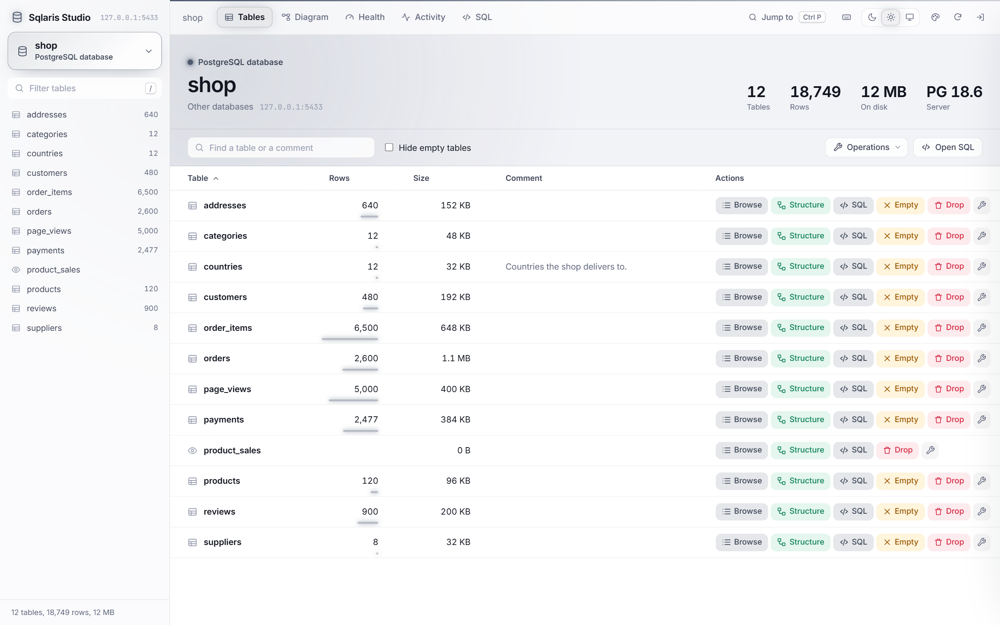

The screenshots are of `shop`, a small sample store database with 12 tables and about
19,000 rows. The Docker quick start below comes with the same database, so you can try
everything on it before pointing the viewer at your own.

## Quick start

With Docker or Podman, and the demo database:

```
git clone https://github.com/Shivam7414/Sqlaris-Studio.git
cd Sqlaris-Studio
VIEWER_PASSWORD=pick-one docker compose up
```

Open `http://127.0.0.1:8765/` and sign in as `demo` with the password you picked. More in
[Docker and Podman](#docker-and-podman).

With PHP on your own machine:

```
git clone https://github.com/Shivam7414/Sqlaris-Studio.git
cd Sqlaris-Studio
cp .env.example .env
cp config.example.php config.php
php -S 127.0.0.1:8765 router.php
```

Fill in `.env` first (see [Setup](#setup)), then open `http://127.0.0.1:8765/`.

## When to use something else

If you want a full database client with drivers for everything, an ER designer, data
compare and a schema history, use DBeaver, DataGrip or Navicat. They are much bigger
projects and they do more.

Sqlaris Studio is for the other case: a light browser tab next to your app while you
develop, that needs nothing but PHP, starts in a second, and makes it hard to change the
wrong database by accident.

## What it does

### Browse and edit rows

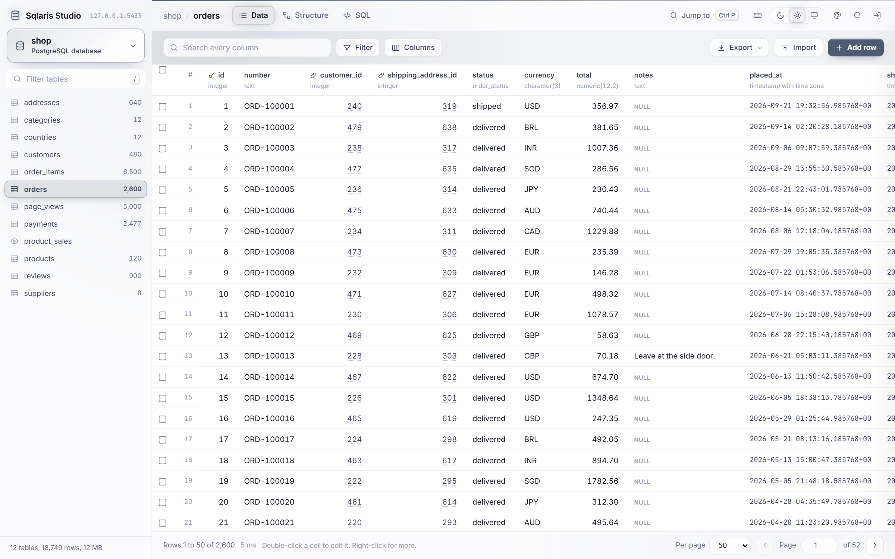

- Exact row counts, sorting, a search across every column and per-column filters
  (equals, contains, greater than, is NULL and more).
- Edit cells in place like a spreadsheet. Dates get a calendar, enums and CHECK lists get
  a dropdown, and a foreign key gets a search of the table it points to. Every edit can be
  undone from the toast.
- Paste a block of cells from Excel or Google Sheets straight into the grid.
- Import a CSV file or pasted rows, with column matching and an optional update of rows
  whose primary key already exists.
- Export the matching rows as CSV, JSON or SQL INSERT statements.
- Select many rows to copy them, set one value on all of them, or delete them.
- Open a row to see every field with its type and comment, follow its foreign keys, and
  count the rows in other tables that point to it.

| Editing an enum column | Row details |
| --- | --- |
| 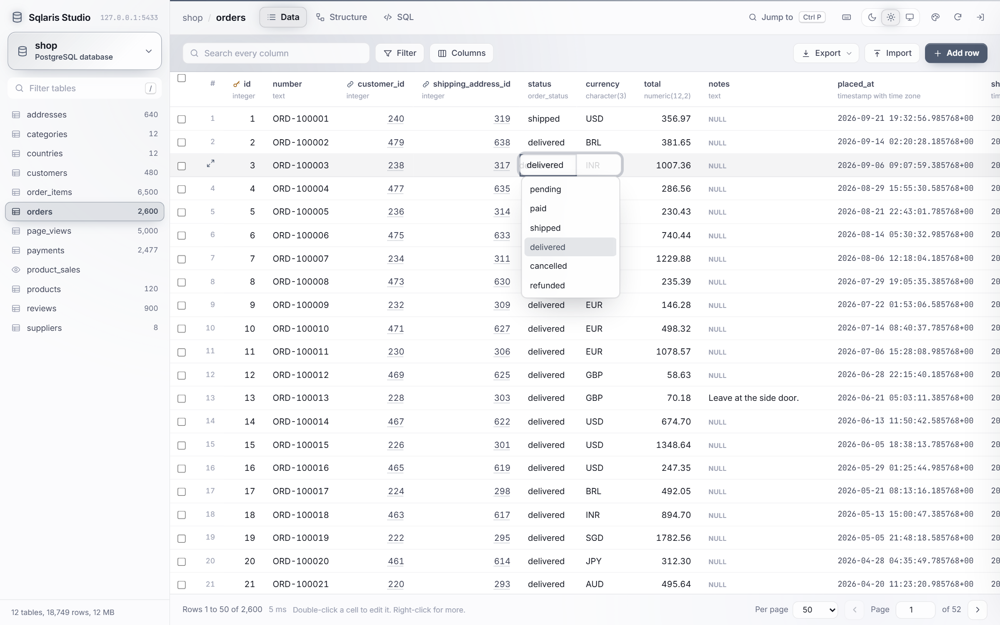 | 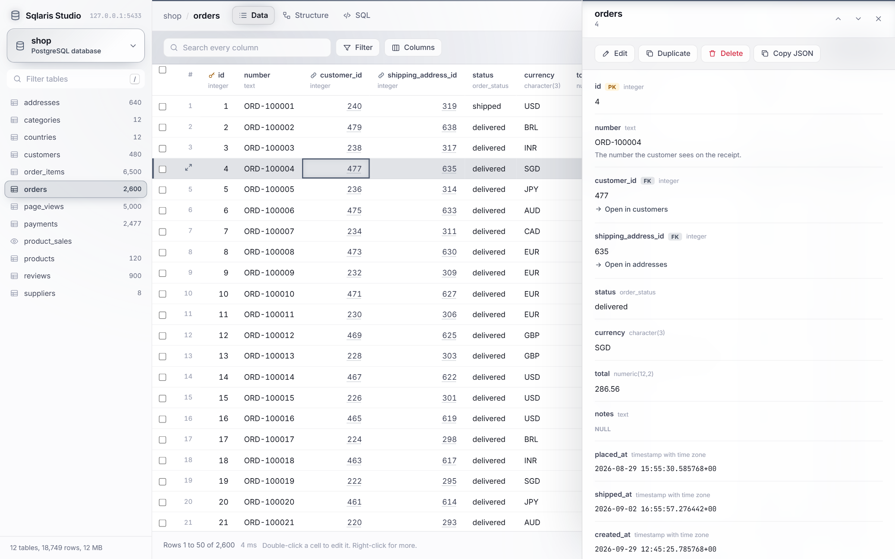 |

Every write to many rows (a paste, an import, a bulk update) runs in one transaction. If
one row fails, nothing is kept and the error names the row.

### Structure

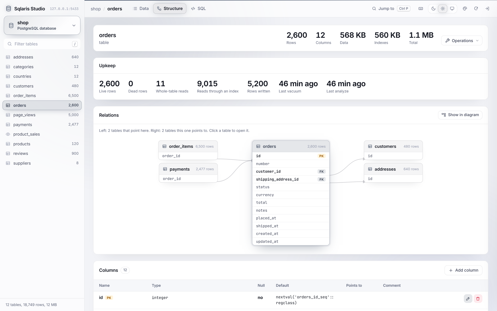

- A structure view with a relations diagram, columns, indexes, constraints, triggers and
  sizes. "Show in diagram" finds the table among all the others.
- Add, change and drop columns: name, type, NULL, default and comment. The form shows the
  exact SQL as you type, and Save runs that SQL and nothing else.

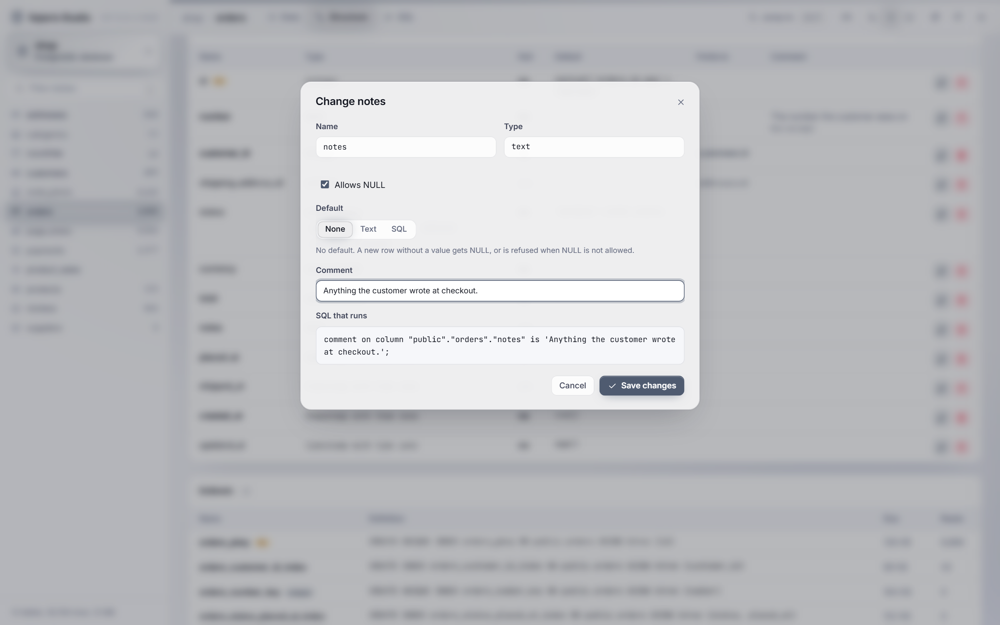

### Diagram

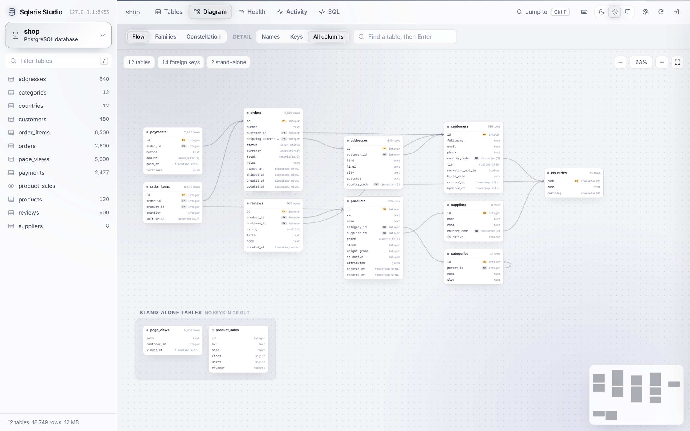

A diagram of the tables and foreign keys in the database, in three layouts: Flow,
Families (grouped by the first word of the table name) and Constellation (linked tables
pull together). Zoom, pan, drag tables where you want them, and use the minimap to move
around. The browser remembers which tables you had out and where you put each one.

A database of up to 40 tables opens whole. A larger one opens on a start panel instead,
because nobody can read a few hundred tables in one picture: find a table, or pick one
of the tables most others point to, and it shows with the tables linked to it. From there:

- The + on the left of a table shows the hidden tables that point to it, and the + on the
  right the ones it points to. They come in beside it, and the tables already out stay
  where they are. Past 20, you pick which ones.
- Click a table for its bar: open it, show its hidden links, hide the rest, hide it, or
  "Path to..." another table, which brings out the shortest chain of keys between them.
- Finding a table that is not out yet brings it out.
- Views keep a set of tables and where they sit under a name, such as "Payroll". They
  are kept in `diagram-views.json` next to `layout.json`, so every browser sees them.
  While some tables are hidden, the Views menu can show them all.

### SQL

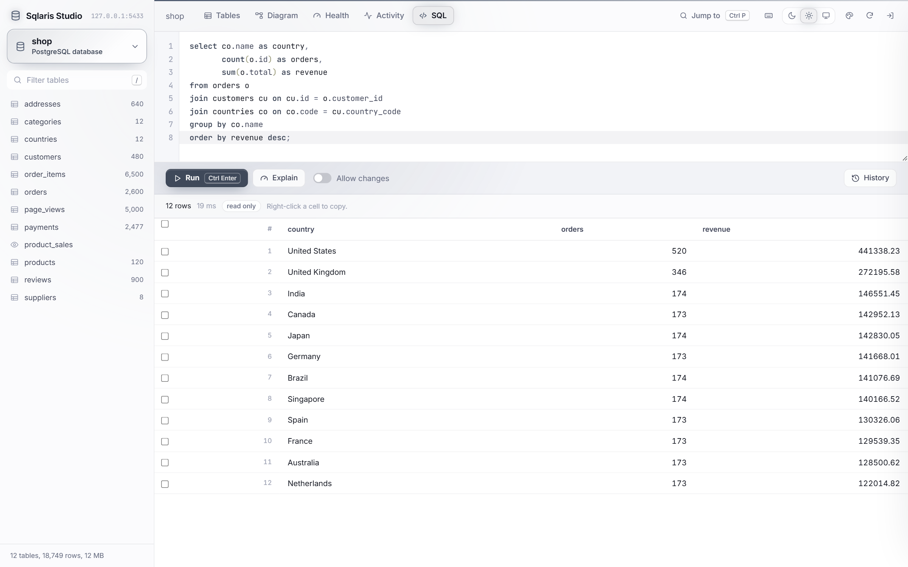

A SQL editor (CodeMirror) with autocomplete for tables, columns and aliases, EXPLAIN and
a history of the last 50 queries. It runs read only unless you turn on "Allow changes".

With changes allowed, the whole script runs in one transaction: it is kept if every
statement works and undone if one fails. Each run is its own request, so a transaction
cannot stay open while you look at the result and decide. The script can end the
transaction itself, with a COMMIT or ROLLBACK of its own or, on MySQL, a statement such
as CREATE TABLE that commits by itself. Then the result says the script ended the
transaction, and if a later statement fails, the error says part of the script may have
been kept. A script that ends the transaction and then starts a new one with BEGIN cannot
be told apart from one that did neither, so leave BEGIN, COMMIT and ROLLBACK out when you
want the whole script kept or undone together.

### Health and activity

| Health | Live activity |
| --- | --- |
| 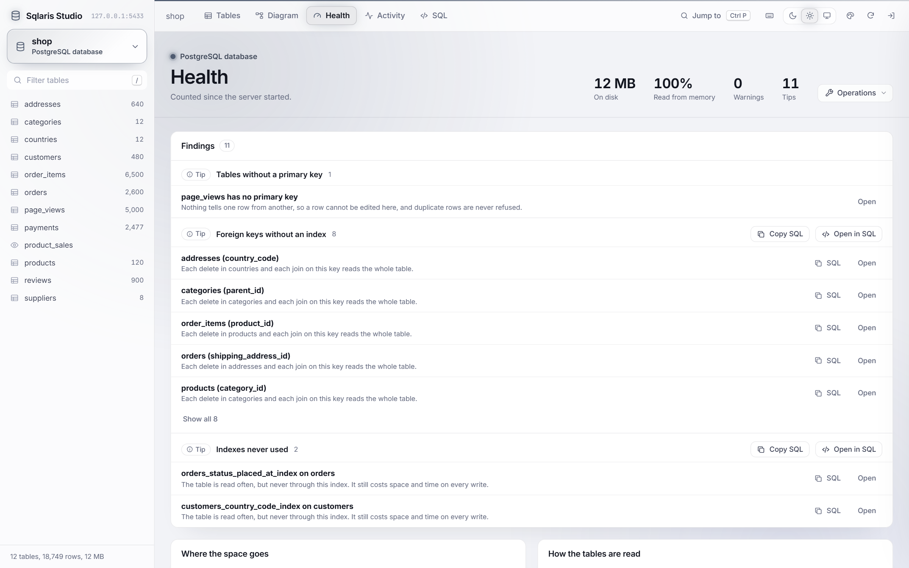 | 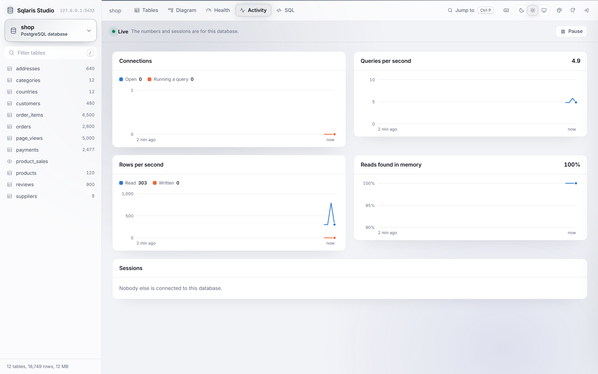 |

- A health tab that flags dead rows, foreign keys without an index, unused indexes, tables
  without a primary key and free space on MySQL, with the SQL to fix each one.
- Live charts of connections, queries, rows and cache hits, plus the open sessions, with
  buttons to cancel a query or end a session.

### Everything else

- Table and database operations: vacuum, analyze, reindex and vacuum full on PostgreSQL;
  optimize, analyze and check on MySQL. Copy, rename, empty or drop a table. Copy, create
  or drop a database. Each table in a database's list has Browse, Structure, SQL, Empty and
  Drop buttons, and a menu for the rest.
- Group, reorder and hide databases in the sidebar. Each database can have its own
  accent colour, so you can tell at a glance which one you are about to change.
- Dark, light and Follow Windows themes, page colour palettes, and keyboard shortcuts
  you can remap.

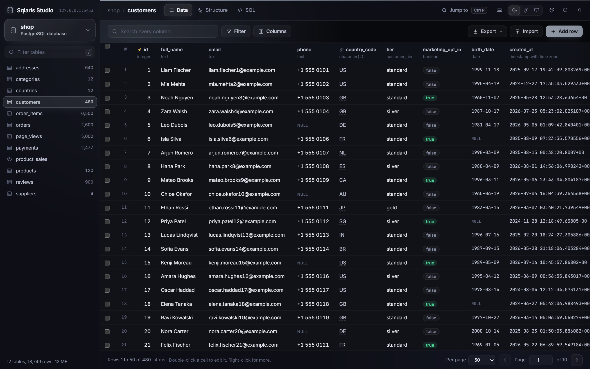

## Requirements

- PHP 8.1 or later, with `pdo_pgsql`, `pdo_mysql`, or both.
- PostgreSQL 12+, MySQL 8.0+ or MariaDB 10.4+. These are the versions the tests run on.
  Older ones may work, but nothing checks that they do.

Or only Docker or Podman, see below.

## Setup

1. Copy `.env.example` to `.env` and fill it in: a username and password for the viewer
   itself, and the host, port and login of your database servers. Leave a server's host
   empty to leave it out.
2. Copy `config.example.php` to `config.php`. It works as it is, and it is where you can
   group and colour your databases later.
3. Start PHP's built-in server from this folder:

   ```
   php -S 127.0.0.1:8765 router.php
   ```

   and open `http://127.0.0.1:8765/`. Under XAMPP or any Apache with PHP, a copy inside
   `htdocs` works without the router.

The viewer refuses every sign-in until both the username and password are set. Changing
either one signs everyone out.

## Docker and Podman

`compose.yaml` starts the viewer and a PostgreSQL server with the demo `shop` database:

```
VIEWER_PASSWORD=pick-one docker compose up
```

`podman compose up` works the same. Compose also reads `.env` in the project folder, so if
you already have one, its `VIEWER_USERNAME` and `VIEWER_PASSWORD` are the sign-in instead
of `demo`.

To open your own databases, run the image on its own and pass the same settings `.env`
takes, as environment variables:

```
docker build -t sqlaris-studio .
docker run --rm -p 127.0.0.1:8765:8765 \
    -e VIEWER_USERNAME=me -e VIEWER_PASSWORD=pick-one \
    -e PGSQL_HOST=host.docker.internal -e PGSQL_PASSWORD=your-password \
    sqlaris-studio
```

`host.docker.internal` is your own computer as seen from the container. On Podman it is
`host.containers.internal`, and on Docker for Linux add
`--add-host=host.docker.internal:host-gateway`. To group and colour databases, mount your
own `config.php` over `/app/config.php`. The sidebar layout and the saved diagram views are
kept in the `/data` volume.

Always publish the port on `127.0.0.1` as above. Inside a container your requests arrive
from the container network's gateway, not from 127.0.0.1, so the image lets that one
address in as well. It finds the address when it starts and prints it; set
`SQLARIS_ALLOW_FROM` (addresses or CIDR ranges, comma separated) to choose it yourself.
Another container on the same network comes from its own address, so it is refused, and
the Host header must still be `localhost` or `127.0.0.1`.

## Configuration

`config.php` builds the list of servers from `.env`. It holds no passwords, but it does
name your databases, so git ignores it. Each option is described in `config.example.php`.

| Option | What it does |
| --- | --- |
| `only`, `hide` | Show only some of a server's databases, or hide some. `*` is a wildcard. |
| `databases` | Rules that put databases into groups and give each a note and a colour. |
| `color` | The accent colour for every database on a server. |
| `label_columns` | Which columns a foreign key search shows to identify a row. |
| `audit_columns` | The columns that "Hide audit columns" hides. |
| `edit_warning` | A message of your own shown above every edit form. |
| `sql_row_limit`, `export_row_limit`, `import_row_limit` | Row limits for the SQL tab, exports and imports. |

Your own arrangement of the sidebar (custom groups, order, hidden databases) is saved in
`layout.json` next to `config.php`, and the diagram views you save in
`diagram-views.json`. Git ignores both.

## Themes and colours

The page is dark by default. The switch in the top bar picks Dark, Light or Follow Windows.
The palette button next to it picks the page colours, each in dark and light. Database, the
default, paints the whole page in the colour of the database you are in, so you can see at a
glance which one you are about to change. Midnight, Graphite, Ocean, Forest, Plum and Sand
paint it in their own colour instead, and the database button, its label and a line along
the top keep the database colour. When the system asks for reduced motion, nothing animates.

## Keyboard shortcuts

Press `?` or `F1` to see them all. Click one in that list and press new keys to change it.
The change is kept in your browser, and Reset brings back the defaults. `Ctrl` also means
`Cmd` on a Mac.

| Keys | Action |
| --- | --- |
| `Ctrl+P`, `Ctrl+K` | Jump to a table, a database or an action |
| `/` | Filter the table list |
| `Ctrl+F` | Search the rows, or find a table in the diagram |
| `F` | Fit the diagram to the screen |
| `Enter`, `F2` | Edit the cell |
| `Shift+Enter` | Open the row details |
| `Ctrl+C` | Copy the cell, or the selected rows |
| `Delete` | Set the cell to NULL |
| `Space` | Select the row |
| `Ctrl+A` | Select every row on the page |
| `Ctrl+S`, `Ctrl+Enter` | Save the row form |
| `Ctrl+Enter`, `F5` | Run the SQL, or only the selected part |
| `Ctrl+Space` | Suggest a table or column in SQL |
| `Ctrl+/` | Comment out a SQL line |

The grid moves like Excel: arrow keys, Tab, `Home`/`End`, `Ctrl+Home`/`Ctrl+End` and
`Page Up`/`Page Down`. Shift+click selects a range of rows and Ctrl+click adds or removes
one.

## MySQL and MariaDB

Everything works on both systems, with a few differences:

- A database is also its schema, so table names have no schema prefix.
- Emptying or dropping a table cannot cascade to the tables that point to it. Do those
  first.
- Copying a database copies the tables with their indexes and rows. Foreign keys, views,
  triggers and routines are not copied.
- The viewer turns on strict mode for its own connection, so an invalid value (an unknown
  enum value, for example) is rejected instead of silently changed.
- `tinyint(1)` is shown as true or false. Binary and spatial columns are shown but cannot
  be edited.
- When a new row's key comes from a DEFAULT expression such as `uuid()`, MySQL cannot say
  which row was created, so the form closes and the row shows up in the list.
- Changing a column rewrites its whole definition. The viewer keeps its collation,
  `ON UPDATE` and `AUTO_INCREMENT`. A generated column's expression is changed in the SQL
  tab.

## Good to know

Edits go straight to the table, so none of your application's own logic runs: no events,
no audit entries, no validation that only lives in code. That is fine for local and test
data, which is what this is for.

A column change here is made on this one database only. If your project keeps its schema
in migrations, the next migration run will not know about it, so put the same change in a
migration too. The copy, rename and drop operations are meant for local data you can
rebuild.

When a column's type changes, every value is converted. If one cannot be, the database
refuses and nothing changes. On PostgreSQL the whole change, rename and comment included,
runs in one transaction.

On PostgreSQL, copying or dropping a database first closes every other connection to it,
because PostgreSQL will not copy or drop a database that is in use. The database named in
the server's `database` setting is used to read the list, so it cannot be dropped from
here.

## Security

- Requests are only accepted from `localhost`, and the Host header is checked, so a web
  page cannot reach the viewer by pointing its own domain at 127.0.0.1.
- `.env`, `layout.json` and `diagram-views.json` are never served. `.htaccess` blocks them under Apache, and
  `router.php` serves only the page, the API and `assets/` under PHP's built-in server.
- Every request needs a signed-in session, and the API only accepts calls from its own
  page.
- Table and column names in queries come from the database catalog, never straight from
  the request. A name the catalog does not know is refused before any SQL is written.
  Sort directions and filter operators come from a fixed list, and page sizes are
  numbers.
- Every value is bound as a parameter. On MySQL, which would read the text `1 or 1=1` as
  the number 1, a value for a number column must be a number before it is sent.
- New names for a copy, a new database or a column may only contain letters, digits and
  underscores.
- A column's type, and a default given as SQL, go into the statement as you write them,
  the same as a query in the SQL tab, but they cannot end it with `;` or a comment. The
  form shows that statement before it runs.
- The SQL tab runs your SQL as it is; that is what it is for. Unless "Allow changes" is on,
  the connection is read only and the transaction is rolled back afterwards. That keeps a
  stray UPDATE from doing damage, but it is a safety catch for you, not a permission
  system: anyone signed in can turn it on.
- Dropping or emptying anything requires typing its name, and system databases such as
  `postgres` or `mysql` can never be dropped.

Each point above has a test in `tests/php/` that sends the hostile version of the request
to the real API and then checks the database directly. Two are not tested: the Apache
rules in `.htaccess`, since the tests use PHP's built-in server, and the refusal to drop a
system database, since a broken check would drop it for real.

If you find a way around any of this, please report it privately through
[GitHub's security advisories](https://github.com/Shivam7414/Sqlaris-Studio/security/advisories/new)
rather than in a public issue.

## Project layout

```
index.php            the page and the sign-in form
api.php              every call the page makes
router.php           for PHP's built-in server
src/lib.php          sign-in, the localhost check and config loading
src/actions.php      what the API does, written once for every database
src/drivers/         what differs between PostgreSQL and MySQL
src/libraries.php    downloads the bundled libraries
assets/app.js        the whole front end
assets/diagram.js    the diagram layouts, also loaded by the tests
assets/app.css
tests/php/           tests for the API, against real databases
tests/*.test.js      tests for the diagram layouts
Dockerfile           the image, for Docker and Podman
compose.yaml         the image with the demo database
docker/              the image's start script and the demo data
```

## Tests

There are two suites, and neither needs anything installed besides PHP and Node.

```
php tests/php/run.php
node --test
```

The PHP suite starts the viewer on PHP's built-in server, signs in through the real form
and calls `api.php` the way the page does. Every check reads the database straight through
PDO afterwards, not through the viewer. It covers:

- The localhost and Host checks, sign-in, the form token, and what the router refuses to
  serve.
- Every screen's data: tables, structure, relations, lookups, health, activity, the
  diagram, exports in all three formats and maintenance.
- Edits, inserts, deletes, pastes and imports, including that a failed paste or import
  keeps nothing.
- Hostile input: SQL in table names, column names, sort directions, filter operators, row
  keys, page sizes, column types and values, and names that contain the quote character.
- That the SQL tab changes nothing unless "Allow changes" is on, even with a `commit;` in
  the script, and that with it on, an error after the script's own `commit;`, or on MySQL
  after a CREATE TABLE, says part of the script may have been kept.

The unit tests always run. The API tests run against each server you give it in
`TEST_PGSQL_*` and `TEST_MYSQL_*`, the same names as in `.env` with `TEST_` in front, set
in the environment or in `tests/.env`:

```
TEST_PGSQL_HOST=127.0.0.1
TEST_PGSQL_PASSWORD=secret
TEST_MYSQL_HOST=127.0.0.1
TEST_MYSQL_PASSWORD=secret
```

Each run makes a database called `sqlaris_test`, fills it, and drops it at the end, so use
a server where that name is free. GitHub Actions runs both suites on every push, with
PHP 8.1 and PostgreSQL 12 and MySQL 8.0, and with PHP 8.4 and PostgreSQL 18 and
MariaDB 11. It also builds the image and signs in to the demo.

## Contributing

Issues and pull requests are welcome. A few things that keep the project the way it is:

- No build step and no package manager. The page loads `assets/app.js` as it is.
- New libraries go in `assets/vendor` through `src/libraries.php`, with their license file.
- Anything that changes data should work on both PostgreSQL and MySQL, or say clearly
  where it does not, and come with a test in `tests/php/api.test.php`.
- Run both test suites before sending a change.

## Bundled libraries

These are kept in `assets/vendor`, each with its license file:

| Library | Version | License | Used for |
| --- | --- | --- | --- |
| [Tom Select](https://tom-select.js.org/) | 2.6.2 | Apache-2.0 | Searchable dropdowns |
| [flatpickr](https://flatpickr.js.org/) | 4.6.13 | MIT | Date and time picker |
| [CodeMirror 5](https://codemirror.net/5/) | 5.65.21 | MIT | SQL editor and autocomplete |
| [Inter](https://rsms.me/inter/) | 5.3.0 | OFL-1.1 | Interface font |
| [JetBrains Mono](https://www.jetbrains.com/lp/mono/) | 5.3.0 | OFL-1.1 | Values, ids and SQL |

To change a version, edit it in `src/libraries.php` and run this from the viewer's folder:

```
php src/libraries.php
```

## License

[MIT](LICENSE)
